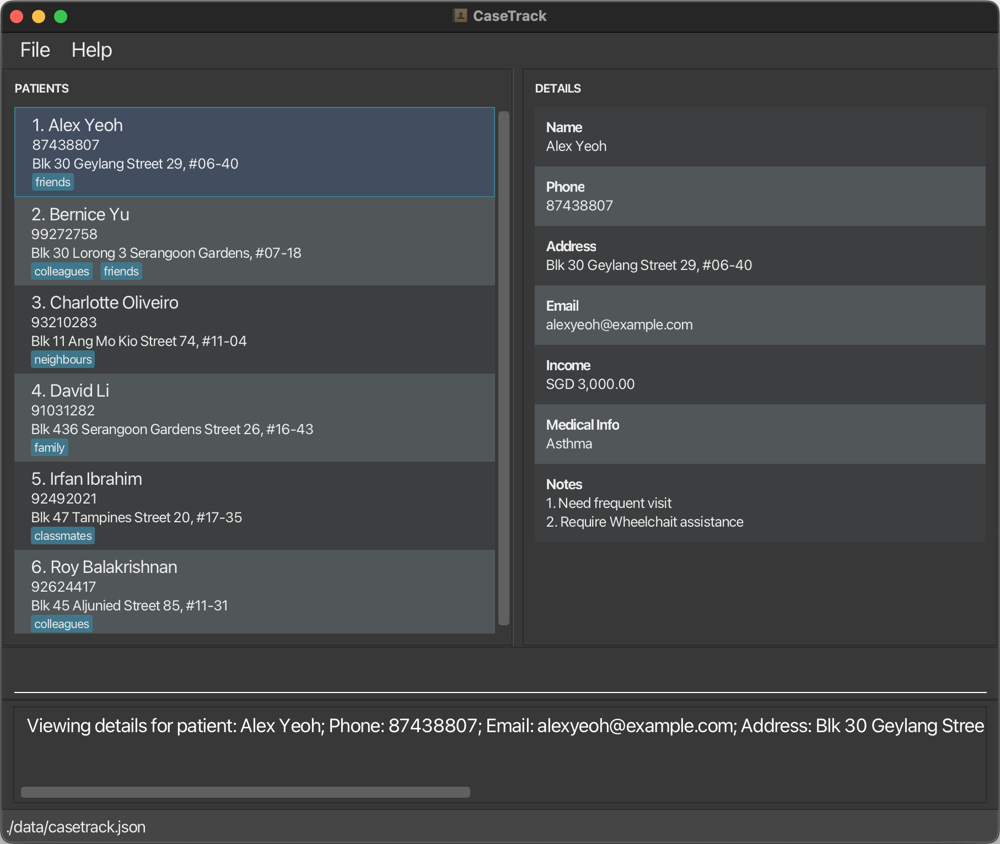

# CaseTrack

**CaseTrack is a desktop application for managing your contact details.** While it has a GUI, most of the user interactions happen using a CLI (Command Line Interface).

* If you are interested in using CaseTrack, head over to the [_Quick Start_ section of the **User Guide**](UserGuide.html#quick-start).
* If you are interested about developing CaseTrack, the [**Developer Guide**](DeveloperGuide.html) is a good place to start.
* This project is a part of the se-education.org initiative. If you would like to contribute code to this project, see se-education.org for more info.
* This project is based on the AddressBook-Level3 project created by the [SE-EDU initiative](https://se-education.org).
