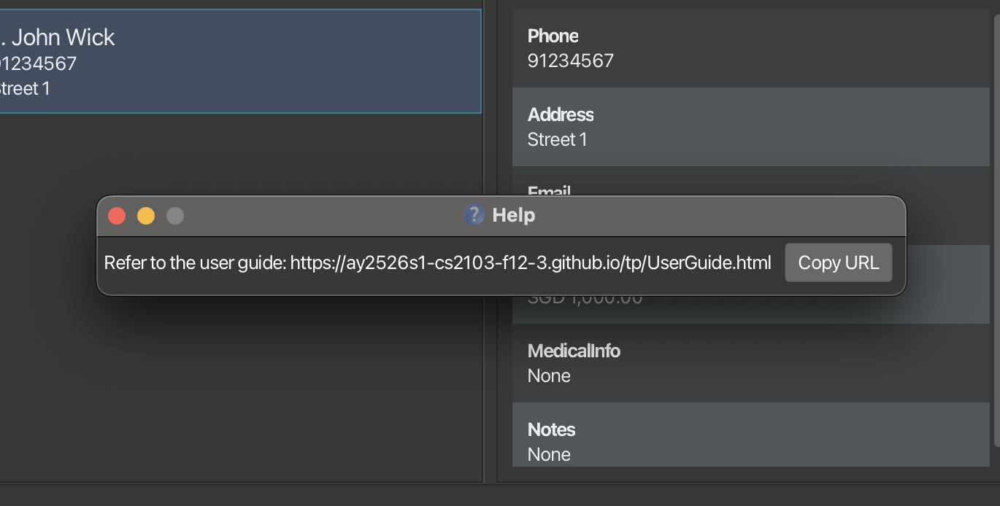
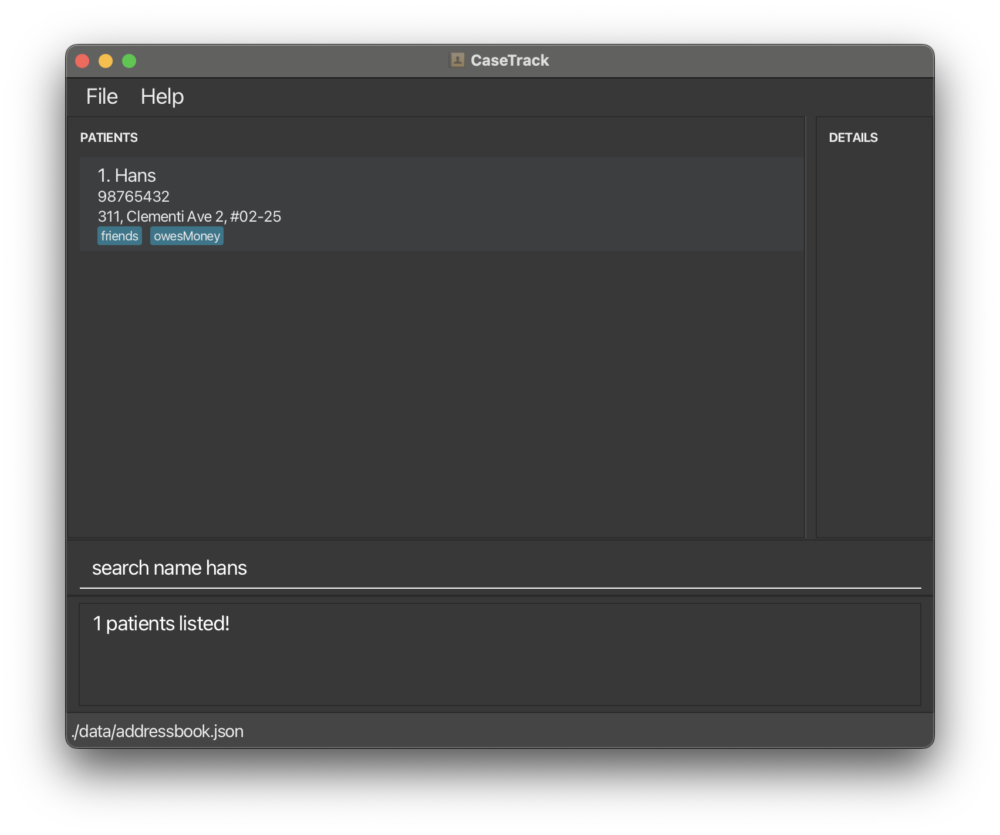
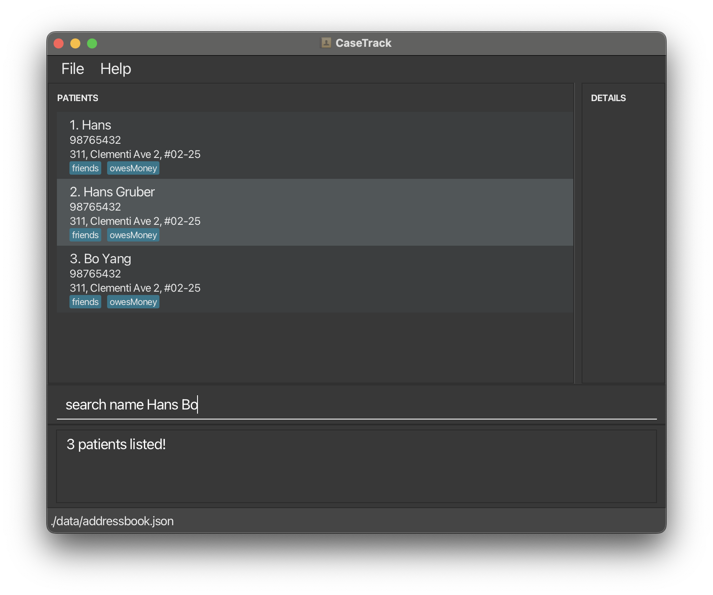
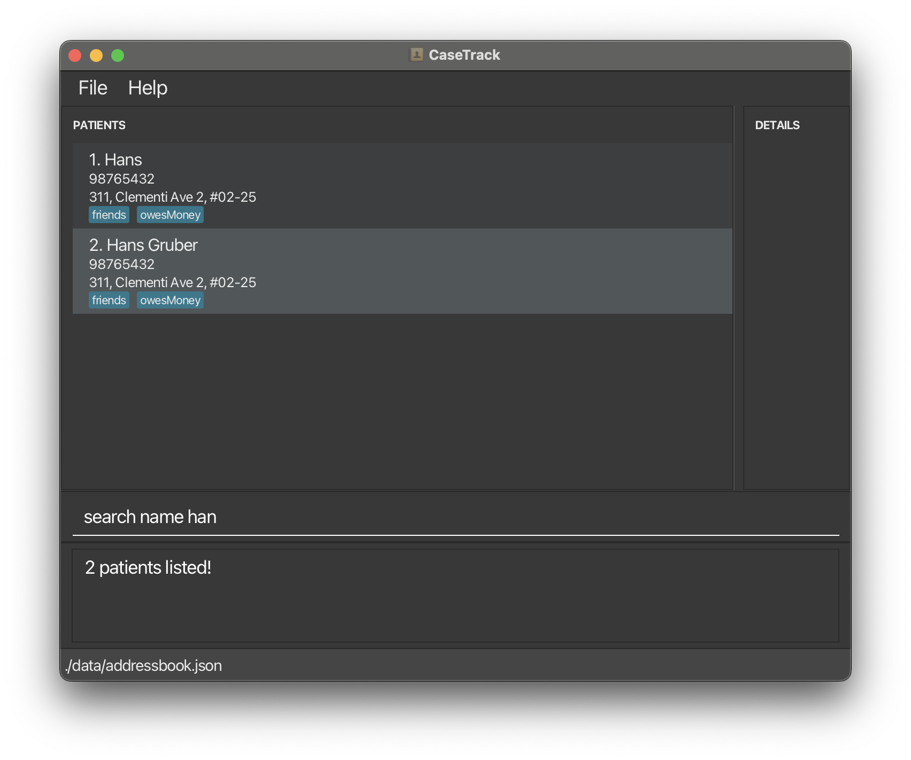
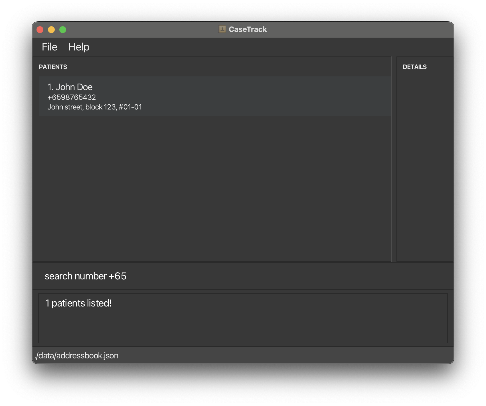
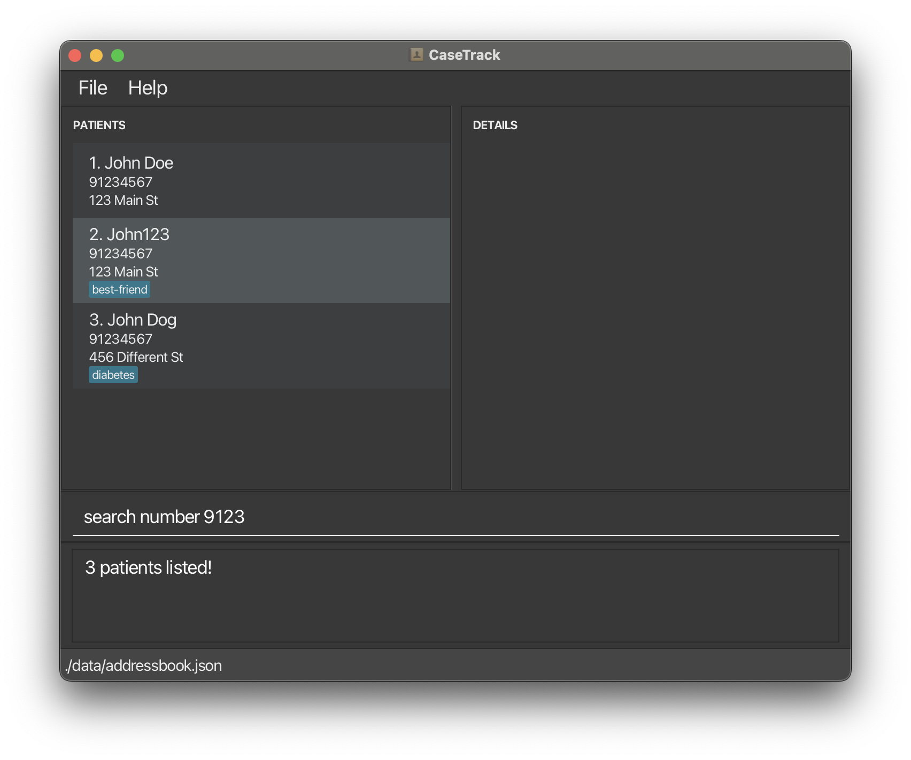
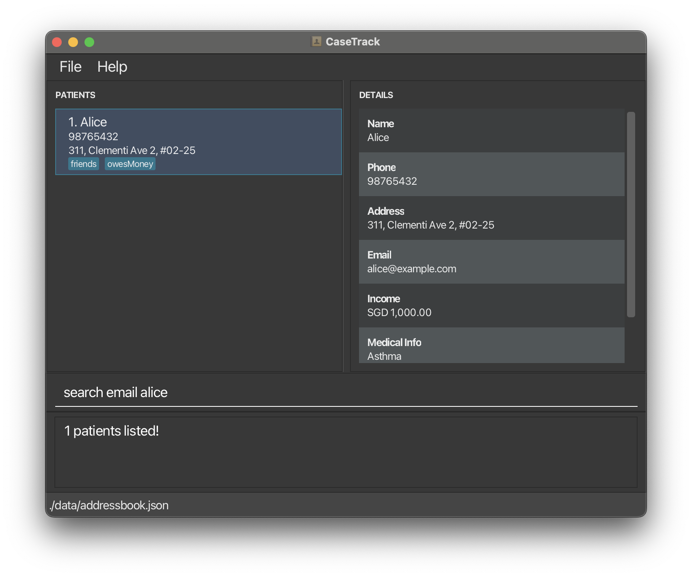
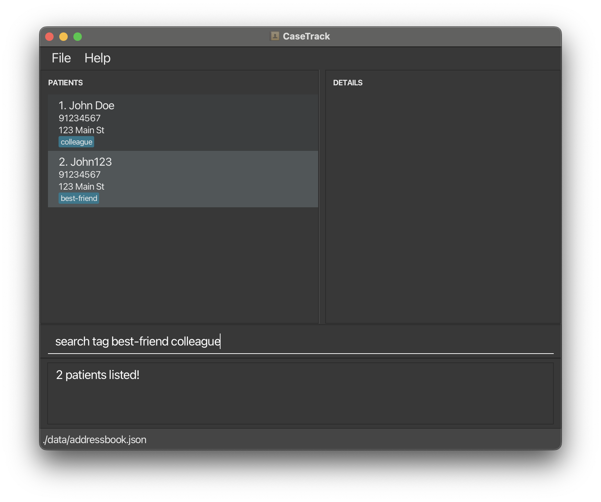
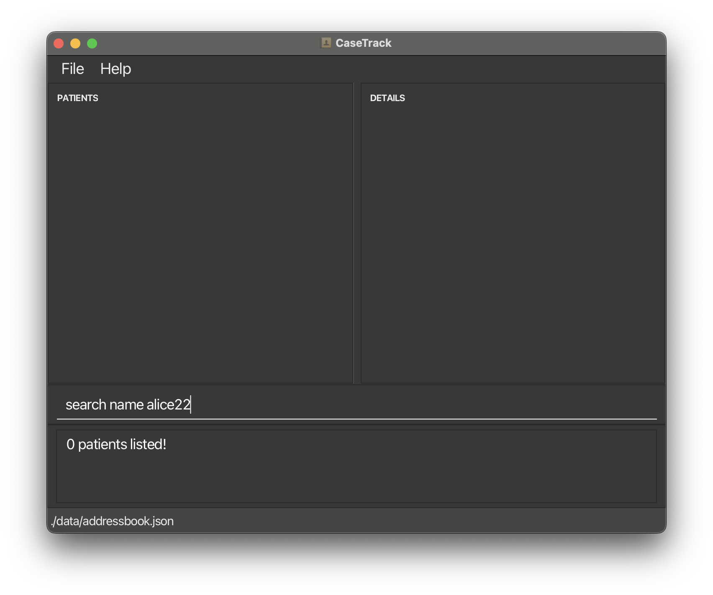

# CaseTrack User Guide

CaseTrack is a **desktop app for managing patients, optimized for use via a Command Line Interface** (CLI) while still having the benefits of a Graphical User Interface (GUI). If you can type fast, CaseTrack can get your patient management tasks done faster than traditional GUI apps.

<!-- * Table of Contents -->
<page-nav-print />

--------------------------------------------------------------------------------------------------------------------

## Quick start

1. Ensure you have Java `17` or above installed in your Computer. 
   **Mac users:** Ensure you have the precise JDK version prescribed [here](https://se-education.org/guides/tutorials/javaInstallationMac.html).

1. Download the latest `.jar` file from [here](https://github.com/AY2526S1-CS2103-F12-3/tp/releases).

1. Copy the file to the folder you want to use as the _home folder_ for CaseTrack.

1. Open a command terminal, `cd` into the folder you put the jar file in, and use the `java -jar casetrack.jar` command to run the application. 

   A GUI similar to the below should appear in a few seconds. Note how the app contains some sample data. 
   

1. Type the command in the command box and press Enter to execute it. e.g. typing **`help`** and pressing Enter will open the help window. 
   Some example commands you can try:

   * `list` : Lists all patients.

   * `add n/John Doe p/98765432 e/johnd@example.com a/John street, block 123, #01-01 i/1200` : Adds a patient named `John Doe` to the CaseTrack.

   * `delete patient 3` : Deletes the 3rd patient shown in the current list.

   * `clear` : Deletes all patients.

   * `exit` : Exits the app.

1. Refer to the [Features](#features) below for details of each command.

--------------------------------------------------------------------------------------------------------------------

## Features

<box type="info" seamless>

**Notes about the command format:** 

* Words in `UPPER_CASE` are the parameters to be supplied by the user. 
  e.g. in `add n/NAME`, `NAME` is a parameter which can be used as `add n/John Doe`.

* Items in square brackets are optional. 
  e.g `n/NAME [t/TAG]` can be used as `n/John Doe t/friend` or as `n/John Doe`.

* Items with `…`​ after them can be used multiple times including zero times. 
  e.g. `[t/TAG]…​` can be used as ` ` (i.e. 0 times), `t/friend`, `t/friend t/family` etc.

* Parameters can be in any order. 
  e.g. if the command specifies `n/NAME p/PHONE_NUMBER`, `p/PHONE_NUMBER n/NAME` is also acceptable.

* Extraneous parameters for commands that do not take in parameters (such as `help`, `list`, `exit` and `clear`) will be ignored. 
  e.g. if the command specifies `help 123`, it will be interpreted as `help`.

* If you are using a PDF version of this document, be careful when copying and pasting commands that span multiple lines as space characters surrounding line-breaks may be omitted when copied over to the application.
</box>

### Parameter Constraints

<box type="info" seamless>

**Notes about parameter formats:** 

* **NAME**: Should only contain alphanumeric characters, spaces, periods (.), apostrophes ('), hyphens (-), 's/o', 'd/o', 'S/O', or 'D/O', and it should not be blank. Names cannot be fully numeric (e.g., `123` or `456789` are not allowed).
  * Examples: `John Doe`, `Dr. Lim`, `o'Connor`, `Mary O'Brien`, `John Jr.`, `Ravichandran S/O Tharumalinga`, `Mary-Jane`, `Jean-Claude`

* **PHONE_NUMBER**: 
  * **Basic Format**: 3-17 digits, numbers only
  * **Country Code** (optional): Up to 3 digits with optional `+` prefix
    * With space: `+65 91234567` (recommended) - digits before space = country code
    * Without space: `+6591234567` - first 3 digits = country code
  * **Valid Examples**: 
    * `91234567`
    * `+65 91234567` (with space)
    * `+6591234567` (without space)
    * `1 800123456`
  * **Limitations**: 
    * One phone number per patient (add more in notes)
    * No hyphens, spaces within number, labels, or parentheses
    * Not supported: `1234-5678`, `91234567 (HP)`, `(+65) 91234567`

* **EMAIL**: Should be of the format local-part@domain and adhere to the following constraints:
  1. The local-part should only contain alphanumeric characters and these special characters, excluding the parentheses, (+_.-). The local-part may not start or end with any special characters.
  2. This is followed by a '@' and then a domain name. The domain name is made up of domain labels separated by periods.
  The domain name must:
    - end with a domain label at least 2 characters long
    - have each domain label start and end with alphanumeric characters
    - have each domain label consist of alphanumeric characters, separated only by hyphens, if any.

* **ADDRESS**: Can take any values, and it should not be blank.

* **INCOME**: Should be a valid non-negative number with up to 2 decimal places (e.g., `1200`, `2500.50`).
  * Display: Income is shown with exactly two decimal places. If you enter more than two decimal places, the value is shown rounded to the nearest cent (e.g., `0.00000000000001` displays as `0.00`).
  * Currency: Only Singapore Dollars (SGD) are supported. Enter numeric amounts without any currency symbols; all income is treated and displayed as SGD (e.g., `1200` shows as `SGD 1,200.00`).

* **MEDICAL_INFO**: Can take any values, and it should not be blank.

* **TAG**: Should be alphanumeric and may contain hyphens, without spaces.

</box>

### Viewing help : `help`

Shows a message explaining how to access the help page.

Format: `help`

### Adding a patient: `add`

Adds a patient to the CaseTrack.

Format: `add n/NAME p/PHONE_NUMBER e/EMAIL a/ADDRESS i/INCOME [m/MEDICAL_INFO] [t/TAG]…​`

<box type="info" seamless>

**Constraints:**
* Names should only contain alphanumeric characters, spaces, periods (.), apostrophes ('), hyphens (-), 's/o', 'd/o', 'S/O', or 'D/O', and it should not be blank
* Names cannot be fully numeric (e.g., `123` or `456789` are not allowed)
</box>

<box type="tip" seamless>

**Tip:** A patient can have any number of tags (including 0)
</box>

Examples:
* `add n/John Doe p/98765432 e/johnd@example.com a/John street, block 123, #01-01 i/1200`
* `add n/Betsy Crowe p/1234567 e/betsycrowe@example.com a/Newgate Prison i/0 m/Asthma t/criminal`

<box type="info" seamless>

**Note on Duplicate Patients:**
CaseTrack prevents adding duplicate patients. A patient is considered a duplicate if **both** the name and phone number match an existing patient:
- Name matching is **case-insensitive** (e.g., "John Doe" = "john doe")
- Extra spaces in names are ignored (e.g., "John Doe" = "John  Doe")
- Multiple patients can share the same name if they have different phone numbers
- Multiple patients can share the same phone number if they have different names

Examples:
- ✅ Allowed: "John Doe" (91234567) and "John Doe" (98765432) - same name, different phone
- ✅ Allowed: "John Doe" (91234567) and "Jane Doe" (91234567) - different name, same phone
- ❌ Blocked: "John Doe" (91234567) and "john doe" (91234567) - duplicate (case-insensitive match)
- ❌ Blocked: "John Doe" (91234567) and "John  Doe" (91234567) - duplicate (whitespace ignored)

</box>

### Listing all patients : `list`

Shows a list of all patients in the CaseTrack.

Format: `list`

### Editing a patient : `edit patient`

Edits an existing patient in the CaseTrack.

Format: `edit patient <PATIENT_INDEX> [n/NAME] [p/PHONE] [e/EMAIL] [a/ADDRESS] [i/INCOME] [m/MEDICAL_INFO] [t/TAG]…​`

* Edits the patient at the specified `PATIENT_INDEX`. The index refers to the index number shown in the displayed patient list. The index **must be a positive integer** 1, 2, 3, …​
* At least one of the optional fields must be provided.
* Existing values will be updated to the input values.
* When editing names, they should only contain alphanumeric characters, spaces, periods (.), apostrophes ('), hyphens (-), 's/o', 'd/o', 'S/O', or 'D/O', and cannot be fully numeric.
* When editing tags, the existing tags of the patient will be removed i.e adding of tags is not cumulative.
* You can remove all the patient's tags by typing `t/` without
    specifying any tags after it.

Examples:
*  `edit patient 1 p/91234567 e/johndoe@example.com` Edits the phone number and email address of the 1st patient to be `91234567` and `johndoe@example.com` respectively.
*  `edit patient 2 n/Betsy Crower t/` Edits the name of the 2nd patient to be `Betsy Crower` and clears all existing tags.
*  `edit patient 3 i/2500.50` Updates only the income of the 3rd patient.
*  `edit patient 4 m/Diabetes` Updates only the medical info of the 4th patient.

### Locating patients: `search`

Finds patients whose specified field contains any of the given keywords.

Format: `search FIELD KEYWORD [MORE_KEYWORDS]`

* The search is case-insensitive. e.g `hans` will match `Hans`

* The order of the keywords does not matter. e.g. `Hans Bo` will match `Bo Hans`
* Patients matching at least one keyword will be returned (i.e. `OR` search).
  e.g. `Hans Bo` will return `Hans Gruber`, `Bo Yang`

* Supported fields: `name`, `number`, `email`, `tag`

**Matching behavior varies by field:**
* **Name search**: Partial matches are supported. e.g. `Han` will match `Hans`, `Hans Gruber`, `Johann`

* **Number search**: Partial matches are supported. e.g. `9123` will match `91234567`
* **Email search**: Partial matches are supported. e.g. `alice` will match `alice@example.com`
* **Tag search**: Partial matches are supported. e.g. `friend` will match tags like `friendly` or `best-friend`

<box type="warning" seamless>

**Important Note on Multiple Search Values (number, email, tag):**
For `number`, `email`, and `tag` searches, multiple keywords are treated as separate search terms with OR logic. This can cause unexpected results:
* `search number 2 1` searches for numbers containing "2" OR "1" separately (won't find "21 98765432" as intended)
* `search number 21` searches for numbers containing "21" as a sequence (correctly finds "21 98765432")

To search for a specific sequence or value in these fields, provide it as a single keyword without spaces.

**Note:** Name search works differently - multiple keywords are useful for finding different people (e.g., `search name John David` finds anyone named John OR David).

</box>

Examples:
* `search name John` returns `john` and `John Doe` (full word match)
* `search name alex david` returns `Alex Yeoh`, `David Li`
* `search number +65` returns patients with phone number containing `+65` (e.g. `+6598765432`)

* `search number 9123` returns patients with phone number containing `9123` (e.g. `91234567`)

* `search email alice` returns patients with email containing `alice` (e.g. `alice@example.com`)

* `search tag friend colleague` returns patients with tags containing `friend` or `colleague`

**Note:** If no patients match your search criteria, an empty list will be displayed:

### Deleting a patient : `delete patient`

Deletes the specified patient from the CaseTrack.

Format: `delete patient <PATIENT_INDEX>`

* Deletes the patient at the specified `PATIENT_INDEX`.
* The index refers to the index number shown in the displayed patient list.
* The index **must be a positive integer** 1, 2, 3, …​

<box type="warning" seamless>

**Caution:** Deleting a patient is permanent and cannot be reverted.

</box>

Examples:
* `list` followed by `delete patient 2` deletes the 2nd patient in the CaseTrack.
* `search name Betsy` followed by `delete patient 1` deletes the 1st patient in the results of the `search` command.

### Viewing a patient's information : `view`

Displays detailed information about a specified patient in the details panel.

Format: `view <PATIENT_INDEX>`

* View details of the patient at the specified `<PATIENT_INDEX>`.
* The index refers to the index number shown in the displayed patient list.
* The index must be a positive integer 1, 2, 3, …​

Examples:
* `list` followed by `view 2` shows details for the 2nd patient in CaseTrack.
* `search name Benson` followed by `view 1` shows details for the 1st patient in the results of the `search` command.

### Adding a note : `note`

Adds a note to a patient using their list index.

Format: `note <PATIENT_INDEX> t/TEXT`

* `PATIENT_INDEX` refers to the index shown in the displayed patient list and **must be a positive integer** 1, 2, 3, ...
* `t/TEXT` must contain at least one non‑whitespace character.
* Do not repeat the `t/` prefix.

Examples:

* `note 1 t/Follow-up in 2 weeks`
* `note 2 t/Mother mentioned financial difficulties`

### Editing a note : `edit note`

Edits a specific note for a patient.

Format: `edit note <PATIENT_INDEX> <NOTE_INDEX> t/NEW_TEXT`

- Edits the note at the specified `NOTE_INDEX` from the patient at `PATIENT_INDEX`.
- Both indices refer to the index numbers shown in the displayed lists.
- Both indices **must be positive integers** 1, 2, 3, ...
- The patient must have notes to edit.
- `t/NEW_TEXT` must contain at least one non-whitespace character.
- Do not repeat the `t/` prefix.

Examples:

- `edit note 1 2 t/Updated note content` edits the 2nd note from the 1st patient in the CaseTrack.
- `search name John` followed by `edit note 1 1 t/Follow-up completed` edits the 1st note from the 1st patient in the results of the `search` command.

### Deleting a note : `delete note`

Deletes a specific note from a patient.

Format: `delete note <PATIENT_INDEX> <NOTE_INDEX>`

* Deletes the note at the specified `NOTE_INDEX` from the patient at `PATIENT_INDEX`.
* Both indices refer to the index numbers shown in the displayed lists.
* Both indices **must be positive integers** 1, 2, 3, ...
* The patient must have notes to delete.

<box type="warning" seamless>

**Caution:** Deleting a patient note is permanent and cannot be reverted.

</box>

Examples:
* `delete note 1 2` deletes the 2nd note from the 1st patient in the CaseTrack.
* `search name John` followed by `delete note 1 1` deletes the 1st note from the 1st patient in the results of the `search` command.

### Clearing all entries : `clear`

Clears all entries from the CaseTrack.

Format: `clear`

### Exiting the program : `exit`

Exits the program.

Format: `exit`

### Saving the data

CaseTrack's data is saved in the hard disk automatically after any command that changes the data. There is no need to save manually.

### Editing the data file

CaseTrack's data is saved automatically as a JSON file `[JAR file location]/data/casetrack.json`. Advanced users are welcome to update data directly by editing that data file before running CaseTrack.

<box type="warning" seamless>

**Caution:**
If your changes to the data file makes its format invalid, CaseTrack will discard all data and start with an empty data file at the next run.  Hence, it is recommended to take a backup of the file before editing it. 
Furthermore, certain edits can cause CaseTrack to behave in unexpected ways (e.g., if a value entered is outside the acceptable range). Therefore, edit the data file only if you are confident that you can update it correctly.
</box>

### Data security and privacy

<box type="warning" seamless>

**Important: Data Protection Notice**

CaseTrack stores patient data in **plaintext** at `data/casetrack.json`. This includes names, phone numbers, addresses, income, and medical information.

To comply with PDPA and healthcare regulations:

**Use only on secure systems:**
- No internet access or isolated networks only
- Locked rooms with restricted physical access
- Strong passwords/biometric authentication required
- Automatic screen locking enabled

**Protect the data file:**
- Set file permissions to restrict access to `casetrack.json`
- Store backups securely
- Delete data securely when no longer needed

**Organization requirements:**
- Establish data handling policies
- Train staff on data protection
- Get data protection officer approval before deployment

**CaseTrack does NOT provide encryption, user authentication, or audit logging.** Your organization must provide these protections.

See [PDPC Advisory Guidelines for the Healthcare Sector](https://www.pdpc.gov.sg/guidelines-and-consultation/2017/10/advisory-guidelines-for-the-healthcare-sector) for requirements.

</box>

--------------------------------------------------------------------------------------------------------------------

## FAQ

**Q**: How do I transfer my data to another computer? 
**A**: Copy the `data/casetrack.json` file to the new computer's CaseTrack folder. Both computers must meet the security requirements in [Data security and privacy](#data-security-and-privacy). Transfer the file securely (e.g., encrypted USB drive or internal network).

**Q**: Is my patient data encrypted? 
**A**: No, data is stored in plaintext. Use CaseTrack only on secure, offline systems. See [Data security and privacy](#data-security-and-privacy) for requirements.

**Q**: Can I use CaseTrack on my personal laptop? 
**A**: Only if it meets security requirements: no internet access, physical security, and access controls. Get approval from your data protection officer first.

--------------------------------------------------------------------------------------------------------------------

## Known issues

1. **When using multiple screens**, if you move the application to a secondary screen, and later switch to using only the primary screen, the GUI will open off-screen. The remedy is to delete the `preferences.json` file created by the application before running the application again.
2. **If you minimize the Help Window** and then run the `help` command (or use the `Help` menu, or the keyboard shortcut `F1`) again, the original Help Window will remain minimized, and no new Help Window will appear. The remedy is to manually restore the minimized Help Window.

--------------------------------------------------------------------------------------------------------------------

## Command summary

Action     | Format, Examples
-----------|----------------------------------------------------------------------------------------------------------------------------------------------------------------------
**Add Patient**    | `add n/NAME p/PHONE_NUMBER e/EMAIL a/ADDRESS i/INCOME [m/MEDICAL_INFO] [t/TAG]…​`   e.g., `add n/James Ho p/22224444 e/jamesho@example.com a/123, Clementi Rd, 1234665 i/2500 m/Diabetes t/friend t/colleague`
**Edit Patient**   | `edit patient <PATIENT_INDEX> [n/NAME] [p/PHONE_NUMBER] [e/EMAIL] [a/ADDRESS] [i/INCOME] [m/MEDICAL_INFO] [t/TAG]…​`  e.g.,`edit patient 2 n/James Lee e/jameslee@example.com`  e.g., `edit patient 3 i/2500`
**Delete Patient** | `delete patient <PATIENT_INDEX>`  e.g., `delete patient 3`
**List All Patients** | `list`
**Clear All Patients**  | `clear`
**Add Note** | `note <PATIENT_INDEX> t/TEXT`  e.g., `note 1 t/Follow-up in 2 weeks`
**Edit Note** | `edit note <PATIENT_INDEX> <NOTE_INDEX> t/NEW_TEXT`  e.g., `edit note 1 2 t/Updated note content`
**Delete Note** | `delete note <PATIENT_INDEX> <NOTE_INDEX>`  e.g., `delete note 1 2`  e.g., `search name John` followed by `delete note 1 1` deletes the 1st note from the 1st patient in the results of the `search` command.
**Search** | `search FIELD KEYWORD [MORE_KEYWORDS]`  e.g., `search name James Jake`  e.g., `search number 91234567`
**View**   | `view <PATIENT_INDEX>`  e.g., `view 2`
**Help**   | `help`
**Exit**   | `exit`
